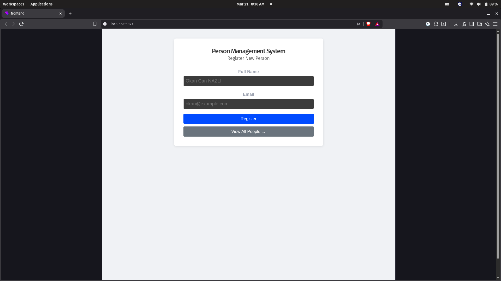
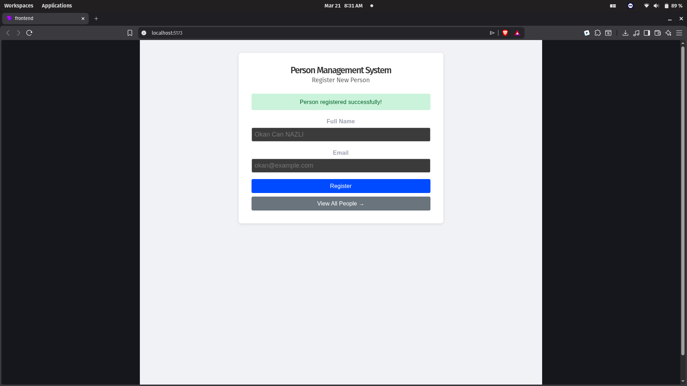
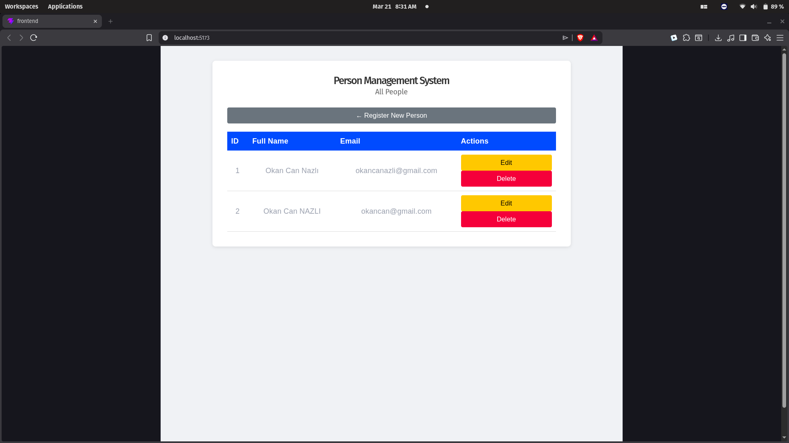
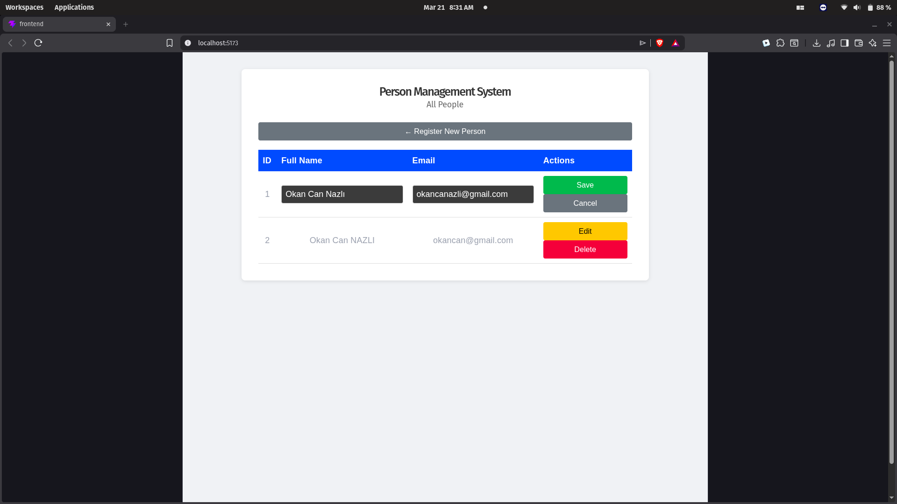
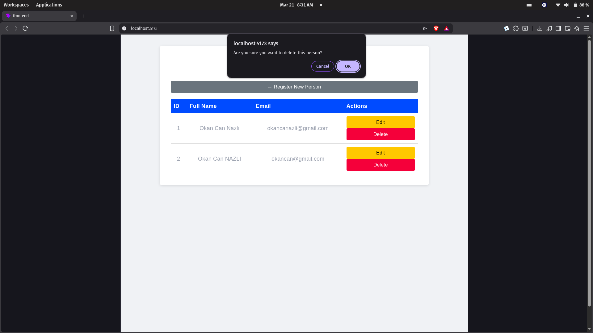

# Person Management System

A full-stack CRUD web application built with React + Express.js + PostgreSQL, containerized with Docker Compose.

## Project Description

This application allows users to manage a list of people. Users can register new people, view all registered people, update existing records, and delete them. The entire system runs inside Docker containers and can be launched with a single command.

## Tech Stack

- **Frontend:** React (Vite)
- **Backend:** Node.js + Express.js
- **Database:** PostgreSQL
- **Containerization:** Docker + Docker Compose

## Setup and Run Instructions

### Prerequisites

- [Docker Desktop](https://www.docker.com/products/docker-desktop/) installed and running

### 1. Clone the repository

```bash
git clone https://github.com/okan-can-nazli/SENG-384-HW.git
cd SENG-384-HW
```

### 2. Create your .env file

```bash
cp .env.example .env
```

### 3. Start the full system with one command

```bash
docker compose up --build
```

### 4. Access the app

| Service  | URL                              |
|----------|----------------------------------|
| Frontend | http://localhost:5173            |
| Backend  | http://localhost:5000/api/people |

### 5. Stop the system

```bash
docker compose down
```

To also delete the database volume:

```bash
docker compose down -v
```

## API Endpoint Documentation

Base path: `/api`

| Method | Endpoint          | Description          | Status Codes         |
|--------|-------------------|----------------------|----------------------|
| GET    | /api/people       | Get all people       | 200                  |
| GET    | /api/people/:id   | Get single person    | 200, 404             |
| POST   | /api/people       | Create new person    | 201, 400, 409        |
| PUT    | /api/people/:id   | Update person        | 200, 400, 404, 409   |
| DELETE | /api/people/:id   | Delete person        | 200, 404             |

### Example POST /api/people

Request body:
```json
{
  "full_name": "Okan Can Nazlı",
  "email": "okancanazli@example.com"
}
```

Response (201):
```json
{
  "id": 1,
  "full_name": "Okan Can Nazlı",
  "email": "okan@example.com"
}
```

### Error Responses

| Error Code | Meaning |
|------------|---------|
| 400 | Missing fields or invalid email format |
| 404 | Person not found |
| 409 | Email already exists |
| 500 | Server error |

## Screenshots

### Registration Form


### Successful Registration


### People List


### Edit Person


### Delete Confirmation


